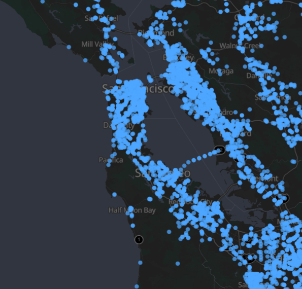
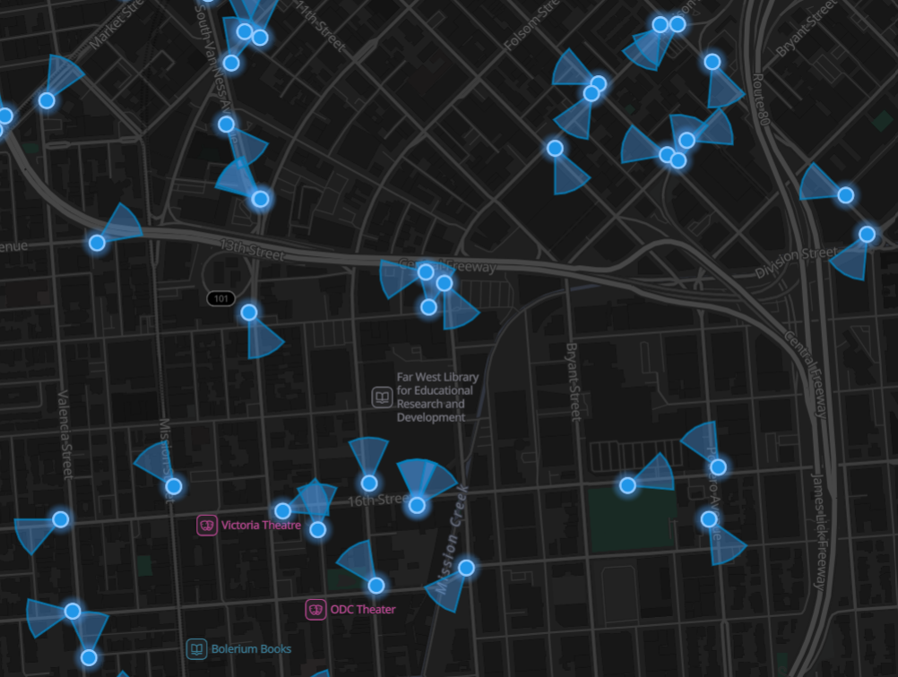

# Project Idea
Flock cameras eemerged as a salient contemporary issue of the American public in the last two years, with many public rights activists criticising the lack of privacy these Flock cameras cause.  
My goal is not to debate this political issue or the ethical implications of such, nor do I want to criticise the the corporate entitty Flock per se, but rather use the datatset of Flock cameras to research the growing surveillance of public life in democratic countries.  
To implement this project in a fun way, I wondered if the most famous spy on Earth, James Bond, could still walk through San Francisco undetected just like he did in the 1985 movie 'A View to a Kill', and if not, how long his possible detour would take today assuming he were aware of all surveillance cameras.

   
  <small><em>Example of Flock Cameras in San Francisco. Data: DeFlock.org</em></small>

## Project Outline
1. Pull data from DeFlock and save as geospatial dataset  
   Note: DeFlock gets data from OSM, I downloaded surveillance cameras data in San Francicso via [Overpass Turbo](https://overpass-turbo.eu/). See /api for more details. 
2. Overlay the Bond route with the surveillance data
3. Run a route-avoidance to generate the 'path of least resistance'
4. Assess model

## Data Source
I use the DeFlock public dataset from [DeFlock.org](https://deflock.org). This specific datatset allows the user to see not only where cameras are positioned, but also in which direction the cameras are pointing and in which vicinity 007 would have to be to be detected by those cameras.

   
  <em>Cameras point in different directions. Data: DeFlock.org</em>

DeFlock uses data from OSM to depict where those cameras are situated in San Francisco. The city is an ideal case study due to the detailed route depicted in the movie and the availability of data.

## See Also: 
[Disclaimer](DISCLAIMER.md)

